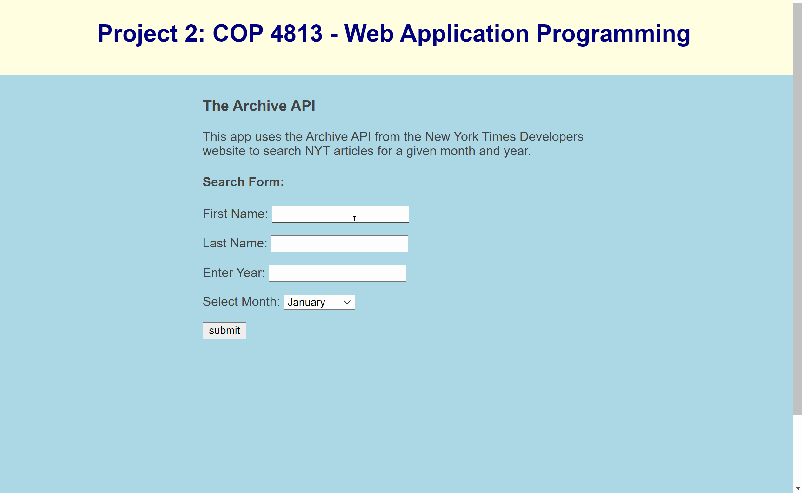

## Author: Aaron Alvarez
### Purpose: The goal of this project is to create a Web application using Python, Flask framework, HTML, CSS, the New York Times API and JSON documents to transmit data across the network.

### Video Walkthrough

Here's a walkthrough of the app:

GIF created with [LiceCap](http://www.cockos.com/licecap/).
